---

---

# Golang笔记\_第2周\_数据类型


2022-4-21 15:29 开始记录go笔记

> 种一棵树最好的时间是十年前，其次，是现在。

当前是在slice 课程，就先从slice开始记录，前面的后期再补充


## 目录

[TOC]


#### 基础数据类型

#### 自定义类型和字符串

#### 数组


#### 数组（array）


#### 切片(slice)

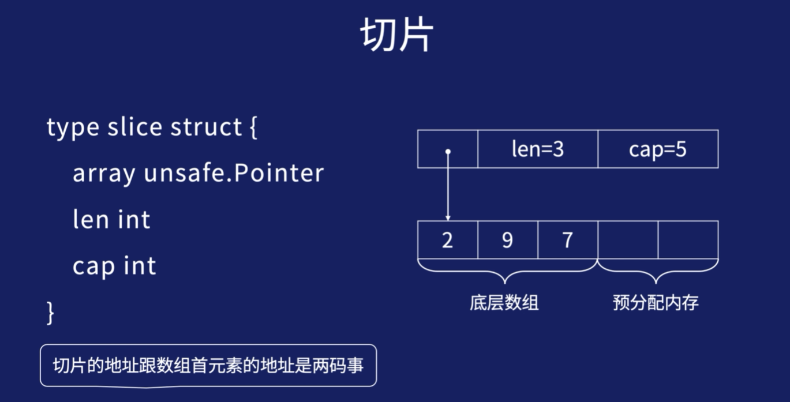


##### 切片的定义

###### 概念待补充

```

```


###### 切片源码定义

```go
type slice struct{
    array unsafe.Pointer
    len int
    cap int
}
```


##### 初始化切片

```GO
var s []int //切片声明
s = []int{}// 初始化，len=cap=0
s = make([]int,3)// 初始化，len=cap=3
s = make([]int,3,5)// 初始化，len=3，cap=5
s = []int{1,2,3,4,5}// 初始化，len=cap=5
s2d := [][]int{
    {1},{2,3},//二维数组各行的列数相等，当二维切片各行的len可以不等
}


// 二维数组的用途   地图


```


###### 二维数组的各行的len可以不相等代码演示

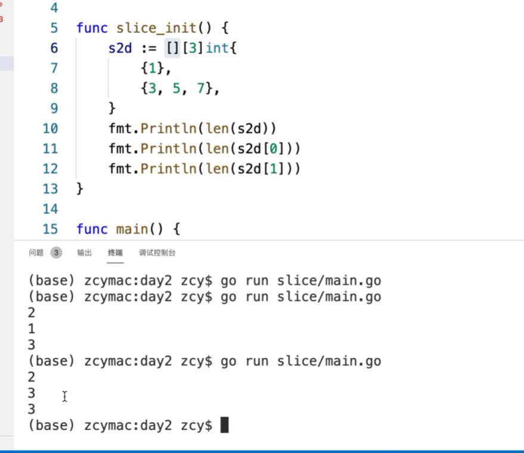


###### 一维切片初始化的代码演示

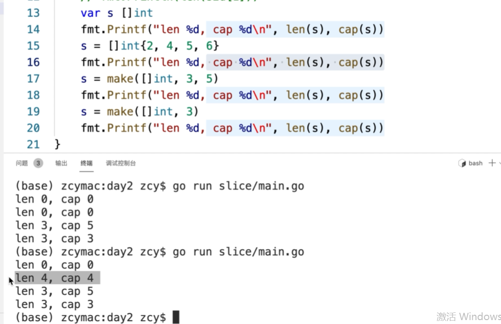


##### append操作


###### 概念解释

> - 切片相对于数组最大的特点就是可以追加元素，可以自动扩容
>
> - 追加的元素放到预留的内存空间里，同时len加1
>
> - 如果预留空间已用完，则会重新申请一块更大的内存空间，capacity变成之前的2倍（cap<1024)或1.25倍(cap>1024).
>
>   把原内存空间的数据拷贝过来，在新内存空间上执行append操作


######  append操作代码演示

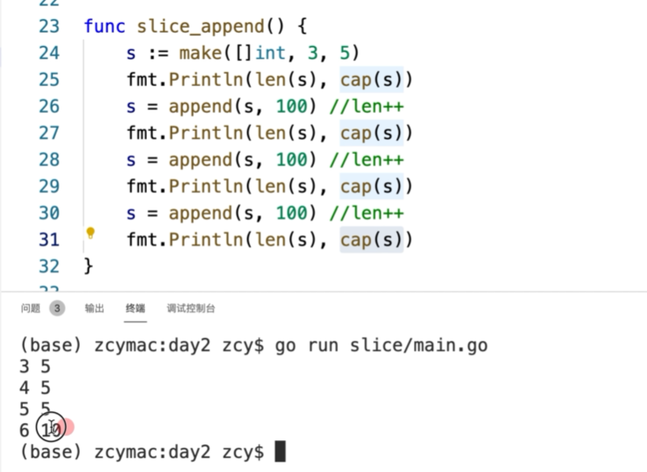


###### append要拿到返回值

不然切片的append的操作不会改变切片的值

python中是s.append(num)就添加了

但是在go语言中必须要要用原切片 s= append（s，100）接受这个值，才能append成功


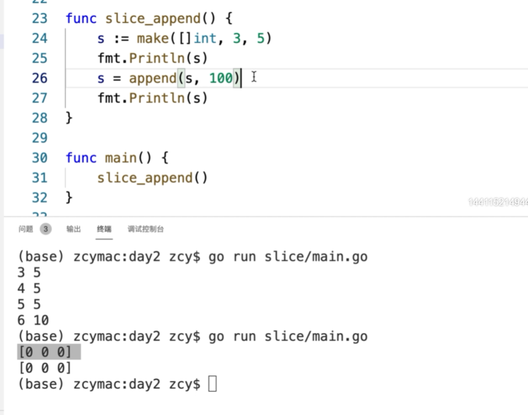


###### 验证slice的cap是否是呈两倍递增

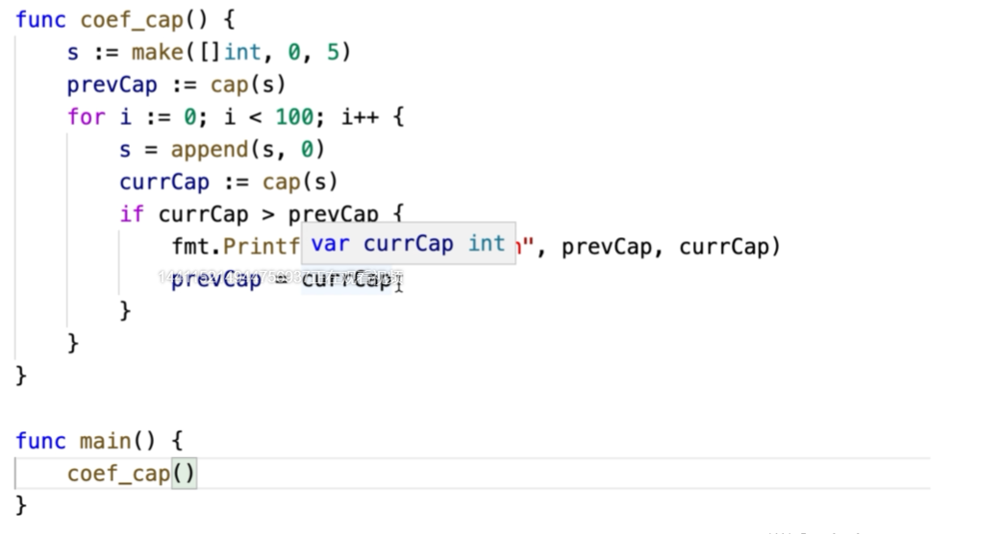


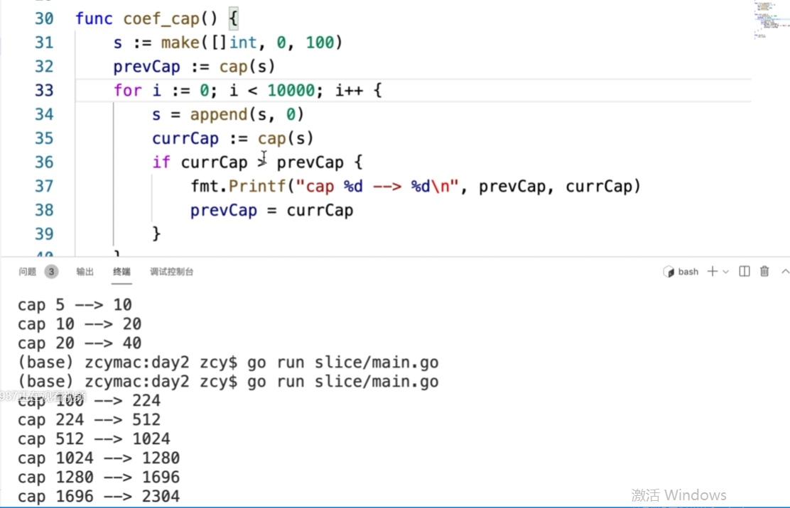


##### 烧脑问题：子切片和母切片的问题

截取子切片

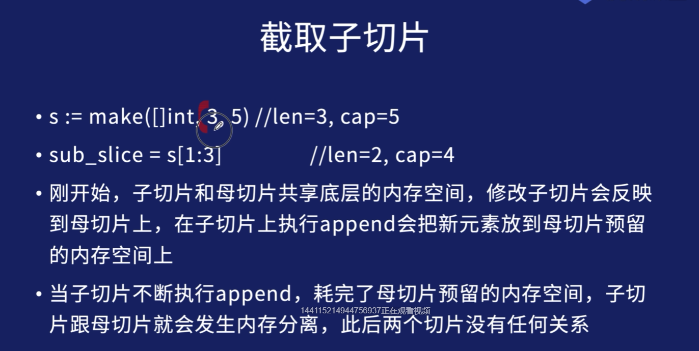


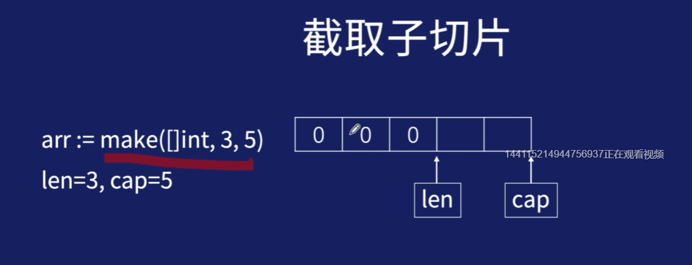

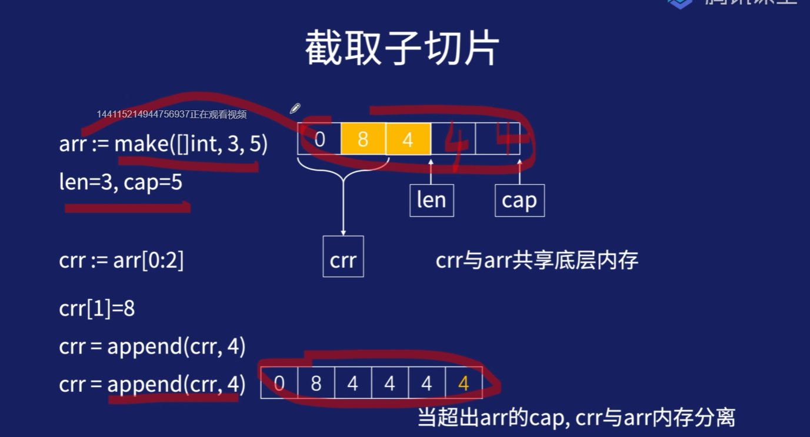


###### 字母切片的代码演示

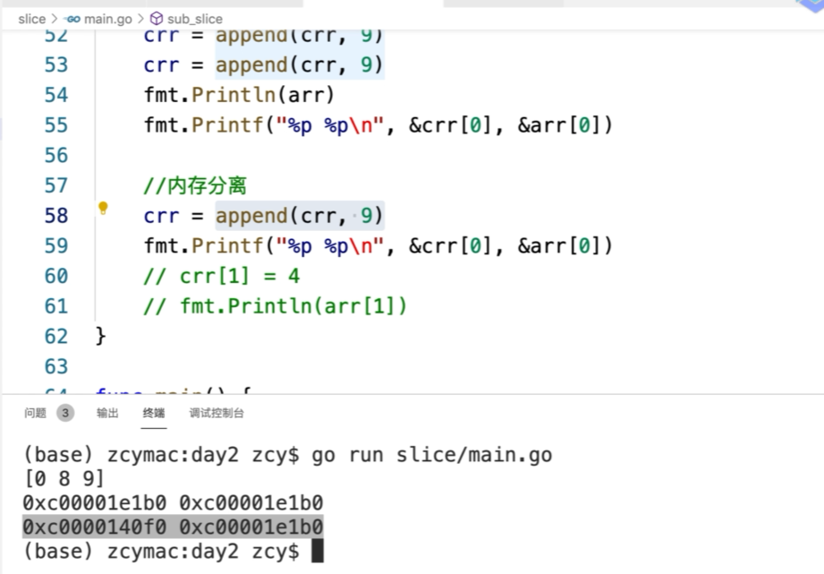


##### 切片传参

名词解释

> - go语言函数传参，传的都是值，即传切片会把切片的{arrayPoint,len,cap}这三个字段拷贝一份传进来
> - 由于传的是底层的数组的指针，所以可以直接修改底层数组里的元素


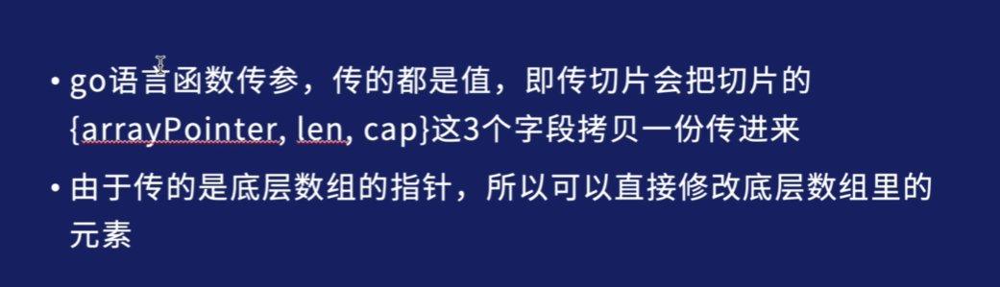


###### 切片传参代码演示

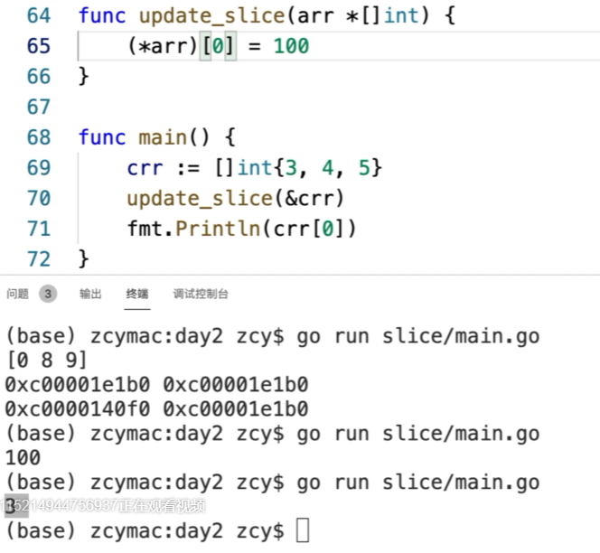


#### map

##### 底层概念图示

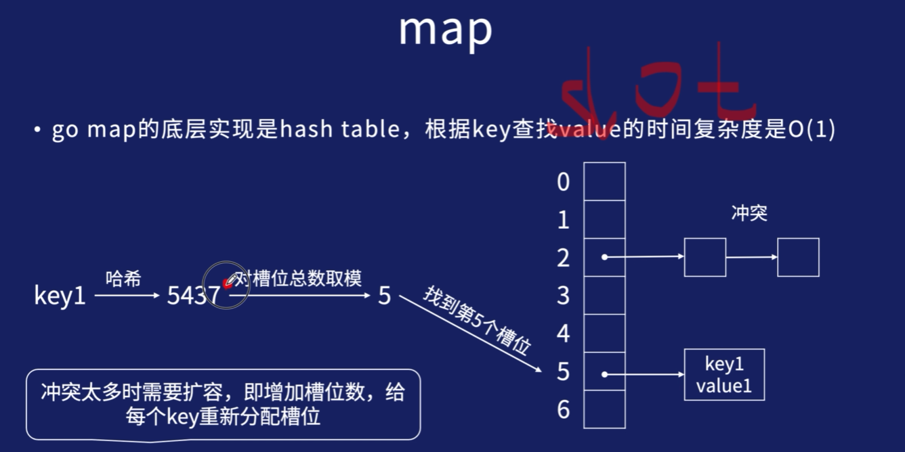


##### map的初始化

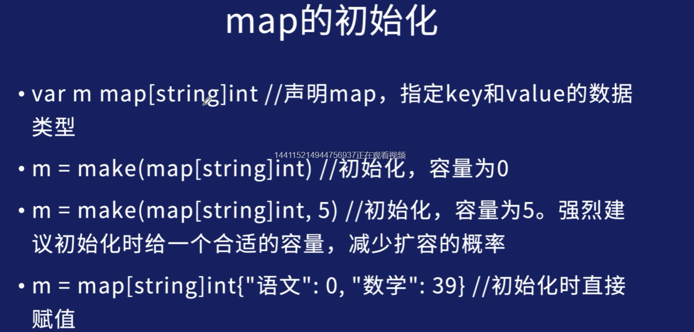


```
#概念文字 
# TODO
```


##### 添加和删除key

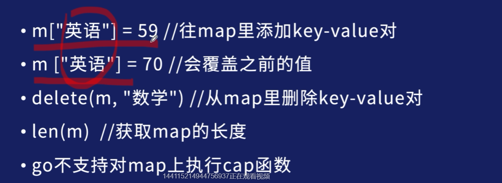


```

```


##### 根据key找value

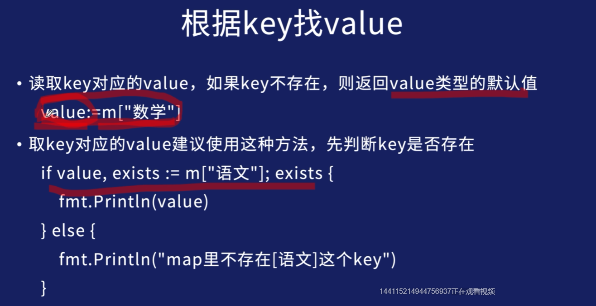


##### 遍历map

map的值是无序的，但是值都是一个环，只是开始的值有变化

```go
for key,value := range m{
	fmt.Printf("%s=%d\n",key,value)
}
```


##### 代码演示

```go
package main

import "fmt"

func main(){
	var m map[string]int
	fmt.Println(len(m))
	m = make(map[string]int) //等价于m = make(map[string]int,0)
	fmt.Println(len(m))
	m = make(map[string]int,10) //cap=10
	fmt.Println(len(m))
	m=map[string]int{"A":3,"B":2,"C":1,"M":5,"N":7}
	fmt.Println(len(m))
	m["D"]=18

	delete(m,"B")

	key:="a"
	v,ok := m[key]
	if ok{
		fmt.Println(v)
	}else{
		fmt.Printf("%s这个key不存在\n",key)
	}


	for key,value := range m{
		// 不能修改map
		value +=2
		//可以修改!!!,值拷贝的问题
		//m[key] +=2
		//fmt.Printf("key:%s value:%d\n",key,value)
		fmt.Printf("value1:%d,value2:%d\n",value,m[key])
	}
	fmt.Println(m)

}
```


#### 管道(chanel)也叫通道


##### 底层原理图

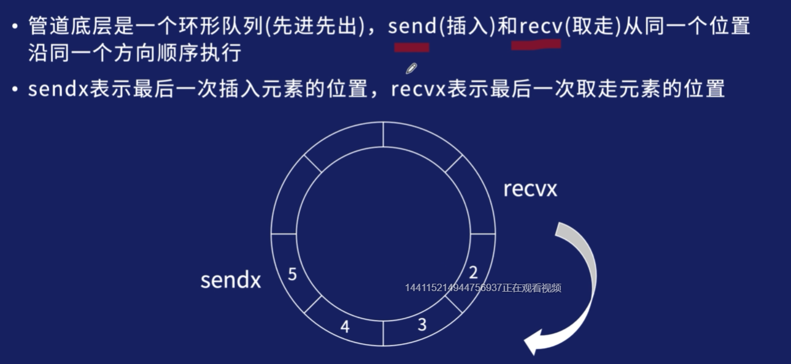


##### 声明和初始化

```go
var ch chan int // 声明
ch = make(chan int,8) //初始化，环形队列里可容纳8个int
```


##### 管道的接收和取操作

- ch <- 1 //往管道里写入(send)数据
- ch <- 2
- ch <- 3
- v := <-ch //从管道里取走(recv)数据
- v = <-ch


##### 遍历管道

```go
close(ch) // 遍历前必须先关闭管道，禁止再写入元素


// 遍历管道里剩下的元素

for ele := range ch{
	fmt.Println(ele)
}
```


##### 代码演示

```go
package main

import "fmt"

func main(){
	var ch chan int
	fmt.Printf("ch is nil %t\n",ch == nil)
	fmt.Printf("len of ch is %d\n", len(ch))

	ch = make(chan int,10)
	fmt.Printf("len of ch is %d\n",len(ch))
	fmt.Printf("cap of ch is %d\n",cap(ch))
	for i := 0;i<10;i++{
		ch <- 3
	}
	fmt.Printf("len of ch is %d\n",len(ch))
	<-ch
	<-ch
	ch <- 3
	fmt.Printf("len of ch is %d\n",len(ch))
	fmt.Printf("cap of ch is %d\n",cap(ch))

	//两种循环方式是等价的，遍历管道
	close(ch)
	L:=len(ch)
	for i := 0;i<L;i++{
		ele := <-ch
		fmt.Println(ele)
	}
	fmt.Println("----------------------")

	//for ele := range ch{
	//	fmt.Println(ele)
	//}
	fmt.Printf("len of ch is %d\n", len(ch))
}

```


#### 引用类型总结

> - slice（数组），map（hastable）和channel（环形队列）是go语言里的3种引用类型，都可以通过**make**函数来进行初始化（申请内存分配）
> - 因为它们都包含一个指向底层数据结构的指针，所以称之为"引用"类型
> - 引用类型未初始化时都是nil，可以对他们执行len()函数，返回0
>
> 


#### 作业

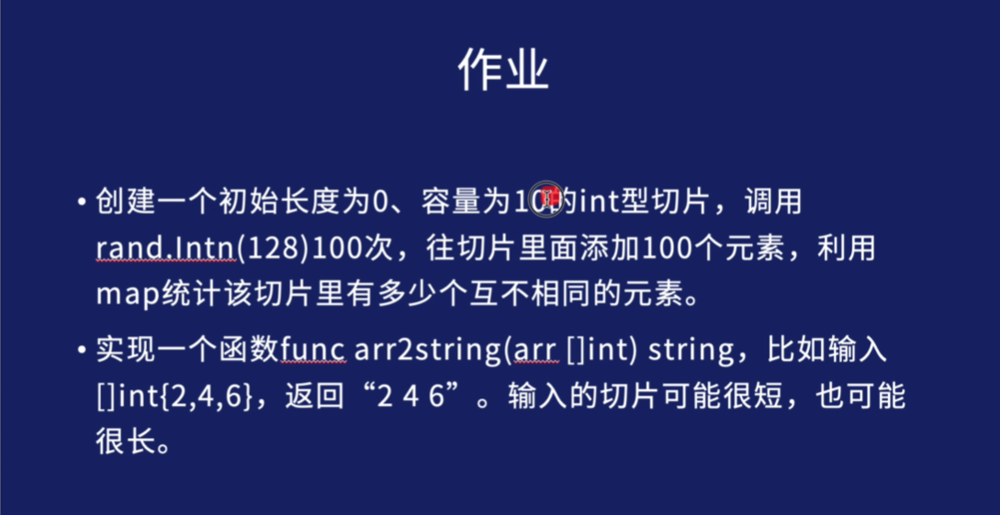